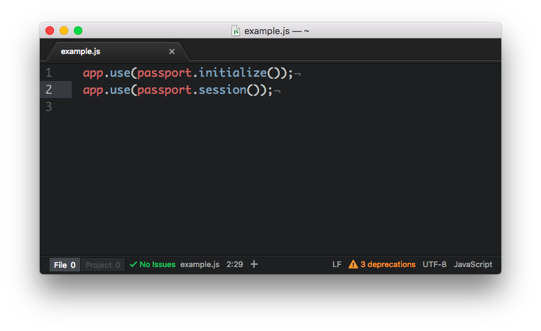
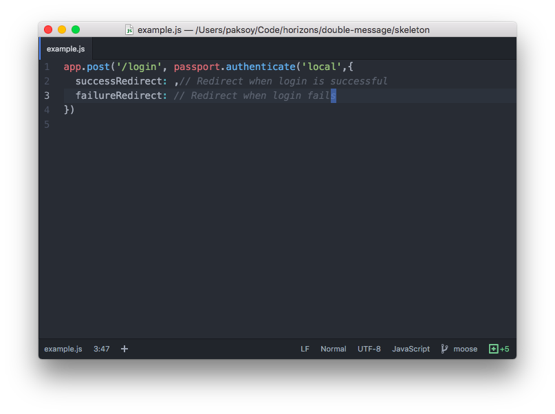
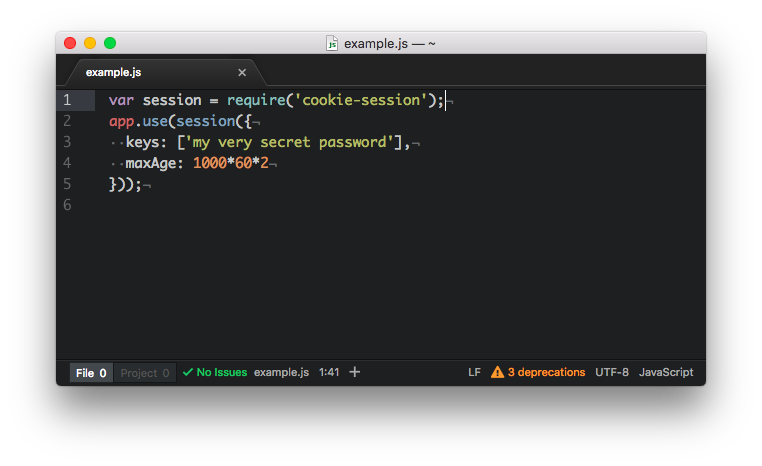
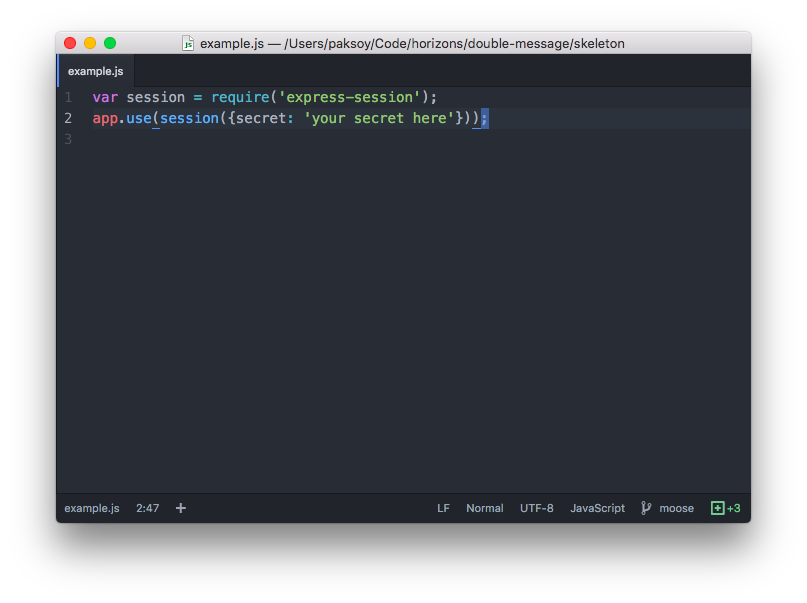
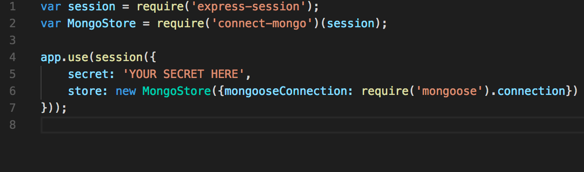
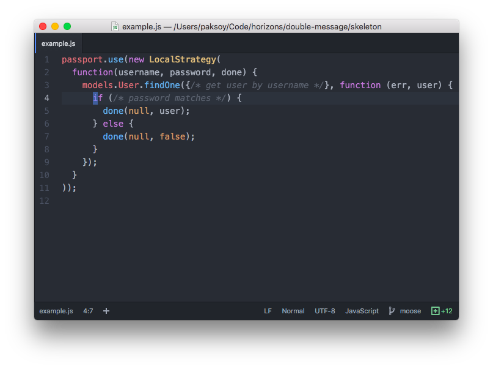

# The Vault (pair exercise)

## Goal

In this exercise we're going to implement a web app with user logins using
[Passport](http://passportjs.org/). We're going implement sessions using
in progressively more secure ways.


## Instructions

Work in `week04/day1/vault` directory. You'll need to add code to `app.js`.

## Exercise 1. Local Strategy

[Passport](http://passportjs.org/) is an NPM package that makes it easy to
implement authentication (i.e. user logins) in your app.

To start with we're going to use the file `passwords.plain.json` as our user
database. This file includes a set of user accounts and passwords. We're going
to allow user logins based on information stored here.

Here are the steps to follow:

1. Install `passport` and the `passport-local` modules.
    - Use `npm install --save`
    - `require()` `passport` and `passport-local` in `app.js`
1. Write a `LocalStrategy`
    - Authenticate users using `passwords.plain.json`.
      Your strategy will read this file into a variable, and check to see the the user who
      is trying to login is in your local password file. You can read json files with
      `require()`:

      ```javascript
      require('./passwords.plain.json')
      ```

    - A `LocalStrategy` takes a `function(username, password, done) {}`.
      This function should read passwords from json, check them and signal to passport success or failure
      using the `done()` function. Like so:

      

1. Add passport into your application with `passport.initialize()` and `passport.session()`:

  

3. Create routes for login and logout in `app.js`:
    - Your `POST /login` route should use `passport.authenticate('local')`:

      

    - The views have been created for you! Don't reinvent the wheel :).
    - Note that you do *not* need routes to sign up new users at this stage. Only users in `passwords.plain.json`
      will be allowed to log in.
4. Add middle-ware to require logins for routes other than `/login` and `/logout`.
5. You can verify that your code is working correctly by:
    - You can login in with a user and the correct password from your password file
    - You cannot login with an incorrect password
    - You cannot login with an invalid (or nonexistent) username

:warning: Notice, that after you login, if you refresh the page, you are logged
out. We'll fix that in Exercise 2! :warning:

## Exercise 2. Sessions with Cookie Session

Once you've got the local strategy working, let's get sessions working as well.
In a typical web application, the credentials used to authenticate a user will
only be transmitted during the login request. If authentication succeeds, a
session will be established and maintained via a cookie set in the user's
browser.  Each subsequent request will not contain credentials, but rather the
unique cookie that identifies the session. This is why you can login and stay
logged in!


1. Install `cookie-session` with `npm` remember to `--save`
1. Add the session to your app

  

  For this exercise, we are going to also play around with the `maxAge` option. This will allow us to specify how long a
  cookie should be valid for. By specifying how long a cookie should last, we can control how much we want a user to relogin.
  Some sites will set this cookie to last for a very long time, this is why you are always logged in. By default, maxAge is set
  to expire when the session ends (close all tabs with the current domain). Set max age to be 2 minutes from now
  (`maxAge:1000*60*2` milliseconds).

1. Tell `passport` how to store users in the session with `passport.serializeUser()`.
  `serializeUser` takes a `function(user, done){}`. We use `done()` to send
  back to passport what part of our user we want to store in the session. In our case,
  this is `user._id`. Passport calls the serialize function the first time a user logs in, before the session
  is updated. We write serialize(), but trust passport to use it properly.

  

1. Tell `passport` how to read users from the session with `passport.deserializeUser()`.
  `deserializeUser` takes a `function(id, done){}`. We need to look up our user
  based on its id in `passwords.plain.json` and return it.
  Passport calls this function every time a logged-in user arrives to populate
  `req.user` with all the information about the user.

  

  Inside the callback we call `done()` to indicate

1. Verify that your session is working by checking that you stay logged in.
    - Now you should see two new cookies in your browser: `session` and `session.sig`. `session` stores all the information about your session and `session.sig` is a cryptographic signature of your session that proves to the server that you have not tampered with your session. The cryptographic signature is created using the secret key in the server.
    - After 2 minutes, do you have to log in again?


Awesome, we now have sessions that last more than just a page load. But we can actually get even more fine grained control of our strategy. Read on!


# Exercise 3.1: Setup MongoDb

TODO mongo setup 

# Exercise 3.2: Make sessions persistent

If you want to keep your sessions completely confidential, `cookie-session` isn't for you.
You can read the contents of your session using the builtin `atob()` function.
Try this in your DevTools console: copy the value of your `session` cookie then call
`atob('cookie value here')`. We can move all session information to the server, where it's
hidden from the user, with `express-session`.

1. Remove the old `cookieSession` and `app.use(cookieSession...` code. You don't
  need it anymore.
1. Install `express-session` with npm.
1. Add `express-session to your app.

  

1. Verify that your logins still work. But now, when you restart `node` you should be
  logged out.

These sessions are now stored in `node`. But everytime `node` restarts it forgets
everything, so you're logged out. Now let's make sessions stick around i.e. persist
using our database, MognoDb.

1. Install the `connect-mongo` npm package, this is how we will connect our sessions
  to MongoDb.
1. Set the `store` property of `express-session` to use `connect-mongo` now.

  

1. Verify that your sessions don't die by logging in and restarting `node`. You should
  stay logged in!
1. You should now see a new Collection in mLab names `sessions`. This is where your
  sessions are stored now. Try deleting these and see if you get logged out as a result.

## Exercise 4.1: Hashing

Storing passwords in your database in plain text (i.e. unencrypted) is not
secure. Your users probably reuse their passwords accross many websites. If your
database is hacked, now the hackers can hack your users across many websites. To
mitigate this problem we `hash` passwords before storing them. Hashing is like
encrypting, but irreversible. In other words, given the hashed version of
password, it's nearly impossible to get the original password back.

1. Implement the `hashPassword()` using the `sha256` algorithm. (`sha256` is not
   the most secure password hash function, we're going to learn better ones
   later this week)

  

1. Copy paste your `hashPassword()` functions to a Node console and try
  hashing a couple passwords from `passwords.plain.json` TODO

## Exercise 4.2: Hashed Passwords

Since hashing is irreversible, when a user tries to log in we `hash` the
the password they attempted to use, then we compare the hashed password we
stored when the user first registered. In JavaScript terms:

```javascript
function hash(password) {
  // apply hash function to password
}

if (hashPassword(passwordAttempt) === storedPasswordHash) {
  // Sucessful login
} else {
  // Fail login
}
```

Let's rewrite our `LocalStrategy` to use hashed passwords:

1. Read `passwords.hashed.json` instead of `passwords.plain.json`. Notice that you can't just compare the password sent to you from the browser (`req.bopassword`) with a password in your local file. Instead, you will need to hash the password you receive to compare it with the hashed passwords in the database.
1. Before you look up a username and password in the JSON file, hash your password with the included
   `hashPassword()` function.

  


## Exercise 5.1: Storing users in MongoDb

Let's improve our passport strategy even more! Try storing user accounts in the
database.

1. Create a new `User` model in `models/models.js`
1. Create `GET /signup` and `POST /signup` endpoints for registering new users.
1. Rewrite your `deserializeUser()` to use the new `User` model.
  Use `User.findById()`.

  

1. Rewrite your `LocalStrategy` to use the new `User` model.
  Use `User.findOne()` in conjunction `done()` to do logins.

  

1. Verify that logins and logouts work as before.

## Exercise 5.2: Hashed passwords in MongoDb

Now let's do hashed passwords in MongoDb.

1. Change your user model to have a `hashedPassword` property
  instead of a `password` property. (Delete your old users in mLab.)
1. Update your `POST /signup` endpoint to apply the `hashPassword()`
  function to `req.body.password` before storing it in the model:

  

1. Update your `LocalStrategy` to convert the input password into
  a hashed password as you did in Exercise 4. Then compare this
  value with teh `hashedPassword` property of your users.
1. Verify that logins and logouts work as before.
