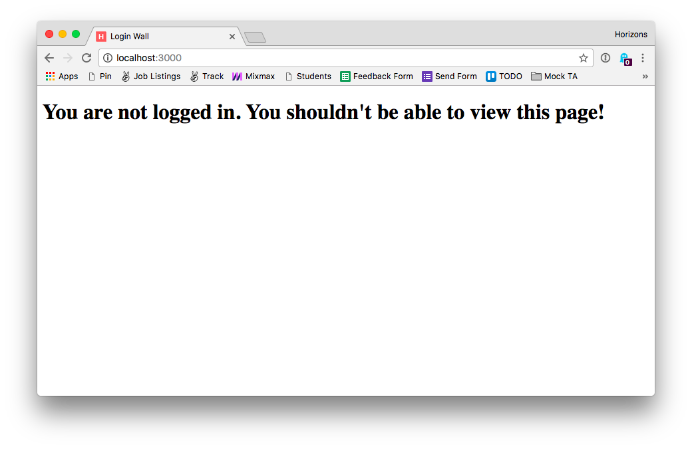

# Warmup Exercise: Login wall

## Instructions

We're given an Express application in `week04/day3/login-wall`. This
application has a passwordless login system.

To log in, provide any username and you will be logged in. No
passwords necessary.

Your task is to add a single Express middleware function to this application
in the right place so that the following endpoints are only accessible
when logged in:

1. `GET /`
1. `GET /private`
1. `GET /secret`

Rules:

1. You can only add **one** middleware function to your application in either
  `passport.js` or `routes.js`
1. If a user is not logged in redirect them to `/login` in your
  middleware function.
1. If is a user is logged in `req.user` will be an object like
   `{ username: 'moose' }`. If a user is **not** logged in
   `req.user` will be a falsy value.
1. If a user attempts to view `/` `/private` `/secret` without loggin in
1. If you see this message your code is **not** working yet:

   
