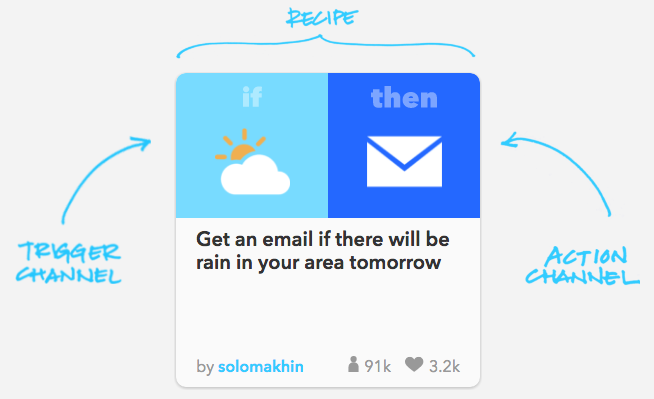
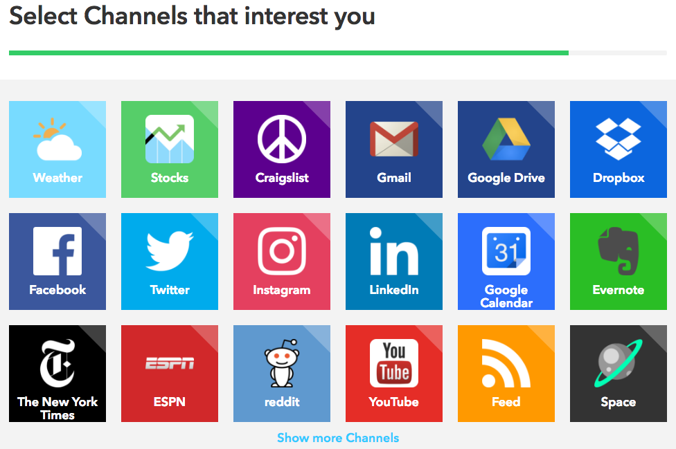

# Warmup exercise: IFTTT
## Time limit: 15 minutes

## Background

IFTTT ("IF this, then that") is a free web-based service that acts as "glue"
between many other apps and services by allowing users to create conditional
statements, called "recipes," linking those apps and services. These statements
are called "recipes." For example, IFTTT can be used to create a recipe that
automatically posts your Instagram photos to Twitter, or automatically sends you
an SMS (via Twilio) when you receive an email from a specific person, or
notifies you [every time an astronaut exits the International Space Station](https://ifttt.com/recipes/193916-did-an-astronaut-exit-space-get-a-notification).

Read more about the [background of IFTTT](https://en.wikipedia.org/wiki/IFTTT),
and check out the thousands of suggested recipes listed at
[IFTTT.com](https://ifttt.com/) in categories such as connected home,
productivity, health, etc.

## Goal

Your goal is to get familiar with how IFTTT works by adding a few recipes. Keep
in mind the things we've learned about APIs and webhooks the past few days, and
try to figure out how IFTTT works under the hood.

## Instructions

1. Start by creating an IFTTT account, if you don't already have one, at
   https://ifttt.com/join. After creating an account, IFTTT will show you short
   explanation of how the service works, and ask you to select channels that
   interest you:

   
   

1. Select a few channels, then hit Continue. IFTTT will then show you a set of
   recommended recipes.
1. Add this recipe: [Share your Instagrams to
   Facebook](https://ifttt.com/recipes/507-share-your-instagrams-to-facebook).
   **Pay close attention to what happens when you connect the Instagram and
   Facebook channels** (there's going to be a quiz later!). Also, notice that
   your web browser may block popups when you try to authenticate with Facebook
   and Instagram. Make sure to allow popups from ifttt.com.
1. Take a photo of the person to your right, post it to Instagram, and make sure
   it shows up on Facebook too 📸✌️🙆🙄
1. Try adding a couple more recipes from the [recommended
   list](https://ifttt.com/recipes), or from the [Channels
   list](https://ifttt.com/channels). You can search for a specific channel,
   such as "Facebook", "Weather", "Dropbox", etc.
1. Try [creating a new recipe from
   scratch](https://ifttt.com/myrecipes/personal/new).
