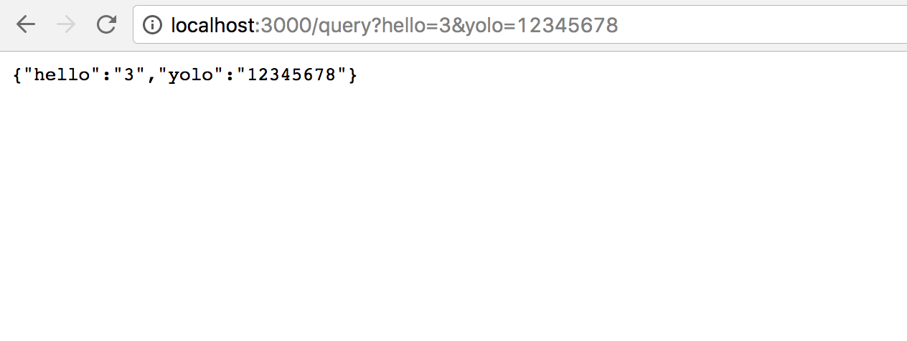

# Hexpress
You have been learning express over the past few weeks, but we have no idea what's behind the curtain. This exercise will walk you through building your own, **very minimal** version of express (called **Hexpress**). The following is a list of features we will implement in this tutorial (in no particular order):

- `app.listen(port)`
- `app.get(route, callback)`
- `app.post(route, callback)`
- `app.user(routePrefix, callback)`
- `req.query`
- `req.params`
- `req.body`
- `res.json`
- `res.send`
- `res.render`

Additionally, we will use `handlebars` for templating (when we use `res.render`). Let's get started!

## [`http`](https://nodejs.org/api/http.html)

The primary purpose of Express is to listen for and respond to incoming HTTP
requests. We're going to use the Node built-in library `http` to assist
us in this task.

The `http` library can be accessed via, `require('http')`. You do **not** need
to `npm install` it.

Here are the parts of the `http` library we need:

1. [`http.createServer([requestListener])`](https://nodejs.org/api/http.html#http_class_http_server)

  Creates a new [`server`](https://nodejs.org/api/http.html#http_class_http_server)
  that will call `requestListener` when it receives a request.

  `requestListener` is function that takes two arguments `req` and `res`.
    1. `req` is an [`http.IncomingMessage`](https://nodejs.org/api/http.html#http_class_http_incomingmessage) object. It has:

      - `req.url`: the full URL of the request including query string.

      - `req.method`: the HTTP method of the request.
    1. `res` is an
  [`http.ServerResponse`](https://nodejs.org/api/http.html#http_class_http_serverresponse) object. It has:

      - `res.writeHead(statusCode, headersObject)`: Sets the status code and headers
    for the response. The `headersObject` is an object where header names are
    keys and header values are values.

      - `res.end(body)`: Send the response body and terminate the request. `body` is a string that contains the whole response body.
1. [`http.Server.listen(port)`](https://nodejs.org/api/http.html#http_server_listen_port_hostname_backlog_callback)

  Begin accepting connections on the specified port.

## Exercise 1: `.listen(port)` and `.get(url, callback)`

Open `week04/day5/lib/hexpress.js`.

You will need to implement the `hexpress` function which creates a new `hexpress` application when called. (just like `var app = express()`) This application will have two methods:

1. `.get(url, callback)`: add a new endpoint that listens to `GET`
  requests where the URL is exactly `url` (excluding the query string).

  If multiple endpoints have the same method and URL, **only** call the one that is registered first. The rest should be ignored.

  When a `GET` request with a matching URL is received, call `callback` with `req` and `res`:

  1. `req.query` is an object that maps query parameters to values.

    **Use:** `req.url` and the Node built-in
    [`querystring`](https://nodejs.org/api/querystring.html)
    library to parse the part of the URL after the question mark `?`.

  1. `res.send(string)` is a function that sets the header `Content-Type` to `text/plain`, the status code to `200`, and sends a `string` back as the response body.

    **Use:** `res.writeHead()` and `res.end()`
  1. `res.send(obj)` is a function that sets the header `Content-Type` to
    `application/json`, the status code to `200`, and sends
    `JSON.stringify(obj)` back as the response body.

    **Use:** `res.writeHead()` and `res.end()`
1. `.listen(port)`: begin accepting connections on the specified port.

  **Use:** `http.Server.listen()`

### Verification

Run `node exercise1.js` and verify that all routes in `exercise1.js` work correctly. Read the comments in `exercise1.js`, they specify the expected behavior of all routes.

`GET /query` should parse the whole query string (something like the following):

<center></center>

## Exercise 2: `.post(url, callback)`

Continue work on `week04/day5/lib/hexpress.js`. Add the `.post()` method:

1. `.post(url, callback)`: add a new endpoint that listens to `POST`
  requests where the URL is exactly `url` (excluding the query string).

  If multiple endpoints have the same method and URL, **only** call the one that is registered first. The rest should be ignored.

  When a `POST` request with a matching URL is received, call `callback` with `req` and `res`:

  1. `req.body` is an object that holds all data in the `POST` body. Usually we use `body-parser` for this task, but we can't do that here because we haven't implemented middleware.

    **Use:** The following code snippet will help you get the request body. You should replace `YOUR-CALLBACK` with a function call to your route's callback function.
    ```javascript
    var body = '';
    req.on('readable', function() {
        var chunk = req.read();
        if (chunk) body += chunk;
    });
    req.on('end', function() {
        // queryString is the querystring node built-in
        req.body = queryString.parse(body);
        // TODO: YOUR-CALLBACK
    });
    ```

### Verification

Run `node exercise2.js` and verify that all routes in `exercise2.js` work correctly. Read the comments in `exercise2.js`, they specify the expected behavior of all routes.

## Exercise 3: `.use(routePrefix, callback)`

Continue work on `week04/day5/lib/hexpress.js`. Add the `.use()` method to `app`:

1. `.use(routePrefix, callback)`: mounts the specified middleware function or functions at the specified path: the middleware function is executed when the base of the requested path matches path. A route will match any path that follows its path immediately with a `/`. For example: `app.use('/apple', ...)` will match `/apple`, `/apple/images`, `/apple/images/news`, and so on.
  - If no path is specified the callback function should run for every request.

### Verification

Run `node exercise3.js` and verify that all routes in `exercise3.js` work correctly. Read the comments in `exercise3.js`, they specify the expected behavior of all routes.

## Exercise 4: `res.render(name, options)`

Continue work on `week04/day5/lib/hexpress.js`. Add the `.render()` method to `res`:

1. `.render(name, options)`: add a new method that, given a file path (to a `.hbs` file), will read the file and *transpile* it into a `.html` file. Then it will render the `html` on your browser.

  **Transpile:** a type of compiler that takes the source code of a program written in one programming language (in this case `.hbs`) as its input and produces the equivalent source code in another programming language (in this case `.html`).

  1. Set the `Content-Type` to `text/html`, the status code to `200`.
  1. Convert the `.hbs` file into a `.html` string.
  1. Send a `html` string through `res.end()`.

    **Use:** The [`handlebars`](https://www.npmjs.com/package/handlebars) `npm` package to convert the `.hbs` into `.html`

### Verification

Run `node exercise4.js` and verify that all routes in `exercise4.js` work correctly. Read the comments in `exercise4.js`, they specify the expected behavior of all routes.

## Exercise 5: `res.params`

Continue work on `week04/day5/lib/hexpress.js`. Add compatibility for using params to `req`:

1. `req.params`: You are to implement a way to go through the `req.url` and create an object that contains all params defined by your route (i.e. given the route `/:name`, a `GET` to `/prath` should return the object `{'name': 'prath'}`).

### Verification

Run `node exercise5.js` and verify that all routes in `exercise5.js` work correctly. Read the comments in `exercise5.js`, they specify the expected behavior of all routes.

## Bonus: `.next()`
The `next` method passes control to the next **matching** route. Implement functionality for the use of the `next()` function. To see a working example of how the `next()` function works try the following:

```javascript
var app = require("express")();

app.get("/", function(req, res, next){
    res.write("Hello");
    next(); //remove this and see what happens
});

app.get("/", function(req, res, next){
    res.write(" World !!!");
    res.end();
});

app.listen(8080);
```

## Double Bonus: `res.render()` with Layouts
Edit your `res.render()` to account for the use of layouts.
