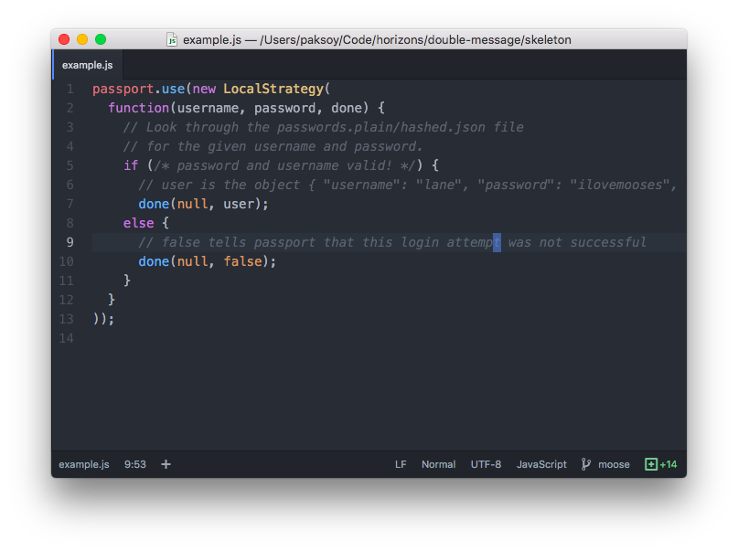
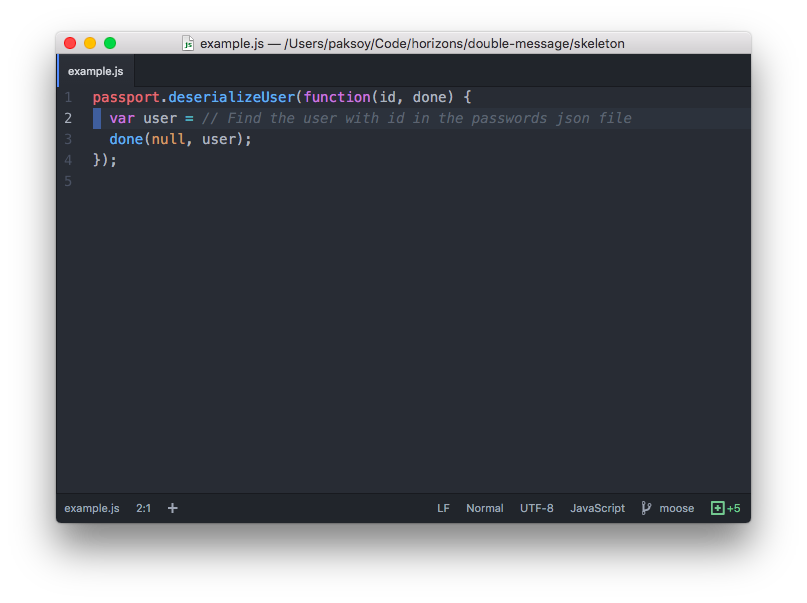
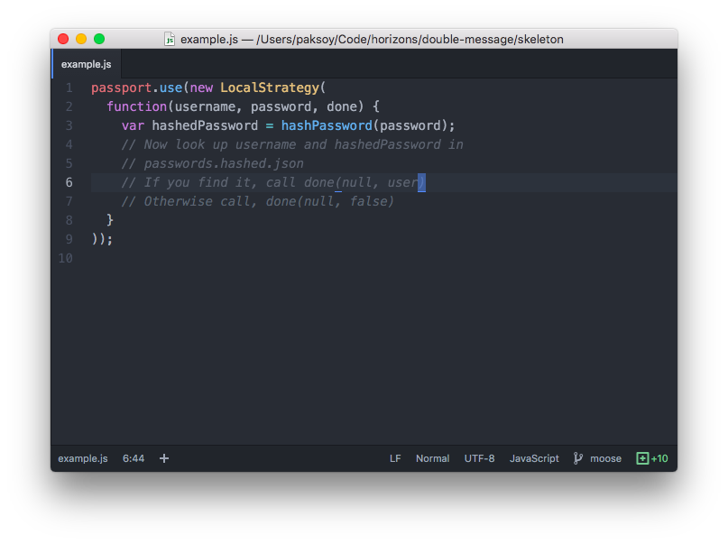

# The Vault (pair exercise)

## Contents

1. [Goal](#goal)
1. [Instructions](#instructions)
1. [Phase 1. Local Strategy](#phase-1-local-strategy)
1. [Phase 2. Sessions with Cookie Session](#phase-2-sessions-with-cookie-session)
1. [Phase 3. Make sessions persistent](#phase-3-make-sessions-persistent)
1. [Phase 4: Hashed Passwords](#phase-4-hashed-passwords)
1. [Phase 5.1 Storing users in MongoDb](#phase-51-storing-users-in-mongodb)
1. [Phase 5.2 Hashed passwords in MongoDb](#phase-52-hashed-passwords-in-mongodb)

## Goal

Your goal is to build a backend webapp that stores top secret sensitive data.
You'll start by building a basic authentication system, then make it more robust
over the course of the project.


## Instructions

Work in `week04/day5/vault` directory. You'll need to add code to the `app.js` and `models/` files.


## Phase 1. Local Strategy

Passport is a very flexible login system. You can store user login information
yourself or delegate that responsibility to someone else, like Facebook with OAuth.

In this exercise, we're going to store login information ourselves as before.
This means we need to use a **local** Passport strategy. The local part means
that **we** store usernames and passwords.

We're going to store usernames and passwords in a very basic format:
a JSON file. (Normally, we'd store them in a database but this is meant to
be as simple as possible.)

Take a look at `passwords.plain.json`. This file includes a set of user accounts
and passwords. We're going to allow user logins based on information stored here.

Here are the steps to follow:

1. Setup your connect.js :). You know the drill. Your connect.js file should go into your `models` folder.
1. Install `passport` and the `passport-local` modules.
    - In the past, we gave you an Express application with passport and passport-local already installed. But it's now your turn!
    - Use `npm install passport --save` and `npm install passport-local --save`
    - Make sure to require passport towards the top your app.js file. Passport should be required before local strategy is
    required and before any of your routes.
1. Write a `LocalStrategy`
    - Authenticate users using `passwords.plain.json`.
      Your strategy will read this file into a variable, and check to see the the user who
      is trying to login is in your local password file. You can read this file with
      `require()`:

      ```javascript
      var userPasswords = require('./passwords.plain.json').passwords;
      ```

    - A `LocalStrategy` takes a `function(username, password, done) {}`.
      This function should read passwords from json, check them and signal to passport success or failure
      using the `done()` function. Like so:

      
1. Add passport into your application with `passport.initialize()` and `passport.session()`:

  

3. Create routes for login and logout.
    - Put all your routes in `app.js`. This will keep your app simple. So, you only need to use `app.get/use/post()` no need for
      `Router` and `require('routes/index')`
    - Your `POST /login` route should use `passport.authenticate('local')` as we have done before.

      

    - The views have been created for you! Don't reinvent the wheel :).
    - Note that you do *not* need routes to sign up new users at this stage. Only users in `passwords.plain.json`
      will be allowed to log in.
4. Add middle-ware to require logins for routes other than `/login` and `/logout`.
5. You can verify that your code is working correctly by:
    - You can login in with a user and the correct password from your password file
    - You cannot login with an incorrect password
    - You cannot login with an invalid (or nonexistent) username

:warning: Notice, that after you login, if you refresh the page, you are logged out. Why is this? Read on to find out. :warning:

## Phase 2. Sessions with Cookie Session

Once you've got the local strategy working, let's get sessions working as well.
Why do we need sessions? Why are sessions useful? Good questions, champ!
In a typical web application, the credentials used to authenticate a user
will only be transmitted during the login request. If authentication succeeds,
a session will be established and maintained via a cookie set in the user's browser.
Each subsequent request will not contain credentials, but rather the unique
cookie that identifies the session. This is why you can login and stay logged in!


1. Install `cookie-session` with `npm` remember to `--save`
1. Add the session to your app

  

  - Until now we have configured the cookie-session module, only specifying the keys to sign our cookies with. However, there
    are many other ways to configure the cookie-session module.
    [Check them out here!](https://github.com/expressjs/cookie-session#cookie-options)
  - For this exercise, we are going to also play around with the `maxAge` option. This will allow us to specify how long a
    cookie should be valid for. By specifying how long a cookie should last, we can control how much we want a user to relogin.
    Some sites will set this cookie to last for a very long time, this is why you are always logged in. By default, maxAge is set
    to expire when the session ends (close all tabs with the current domain). Set max age to be 2 minutes from now
    (`maxAge:1000*60*2` milliseconds).

1. Tell `passport` how to store users in the session with `passport.serializeUser()`.
  `serializeUser` takes a `function(user, done){}`. We use `done()` to send
  back to passport what part of our user we want to store in the session. In our case,
  this is `user._id`. Passport calls the serialize function the first time a user logs in, before the session
  is updated. We write serialize(), but trust passport to use it properly.

  

1. Tell `passport` how to read users from the session with `passport.deserializeUser()`.
  `deserializeUser` takes a `function(id, done){}`. We need to look up our user
  based on its id in `passwords.plain.json` and return it.
  Passport calls this function every time a logged-in user arrives to populate
  `req.user` with all the information about the user.

  

1. Verify that your session is working by checking that you stay logged in.
    - Now you should see two new cookies in your browser: `session` and `session.sig`. `session` stores all the information about your session and `session.sig` is a cryptographic signature of your session that proves to the server that you have not tampered with your session. The cryptographic signature is created using the secret key in the server.
    - After 2 minutes, do you have to log in again?


Awesome, we now have sessions that last more than just a page load. But we can actually get even more fine grained control of our strategy. Read on!


# Phase 3. Make sessions persistent

If you want to keep your sessions completely confidential, `cookie-session` isn't for you.
You can read the contents of your session using the builtin `atob()` function.
Try this in your DevTools console: copy the value of your `session` cookie then call
`atob('cookie value here')`. We can move all session information to the server, where it's
hidden from the user, with `express-session`.

1. Remove the old `cookieSession` and `app.use(cookieSession...` code. You don't
  need it anymore.
1. Install `express-session` with npm.
1. Add `express-session to your app.

  

1. Verify that your logins still work. But now, when you restart `node` you should be
  logged out.

These sessions are now stored in `node`. But everytime `node` restarts it forgets
everything, so you're logged out. Now let's make sessions stick around i.e. persist
using our database, MognoDb.

1. Install the `connect-mongo` npm package, this is how we will connect our sessions
  to MongoDb.
1. Set the `store` property of `express-session` to use `connect-mongo` now.

  

1. Verify that your sessions don't die by logging in and restarting `node`. You should
  stay logged in!
1. You should now see a new Collection in mLab names `sessions`. This is where your
  sessions are stored now. Try deleting these and see if you get logged out as a result.

## Phase 4: Hashed Passwords

Use the `passwords.hashed.json` instead of the plain text passwords. Plain-text passwords are not safe!

Let's rewrite our `LocalStrategy` to use hashed passwords:

1. Read `passwords.hashed.json` instead of `passwords.plain.json`. Notice that you can't just compare the password sent to you from the browser (`req.bopassword`) with a password in your local file. Instead, you will need to hash the password you receive to compare it with the hashed passwords in the database.
1. Before you look up a username and password in the JSON file, hash your password with the included
   `hashPassword()` function.

  


### Playing around with hashing

To gain some familiarity with hashing, open your terminal up and type `node`.
Remember this is a playground for you to now write javascript.

- Copy paste this snippet. `sha256` is the hashing algorithm we are using. The
  crypto library supports many other ones as well.

  ```javascript
  var crypto = require('crypto');
  function hashPassword(password) {
    var hash = crypto.createHash('sha256');
    hash.update(password);
    return hash.digest('hex');
  }
  ```

- Have your partner do the same thing in their terminal.
  Call hashPassword("Darwish"). Notice how you both get the same string?
- Change "darwish" to another word. Try this again with your partner.
- Does this remind you of [this](https://www.youtube.com/watch?v=S5CjKEFb-sM).
  It should. This is cryptography. You are cool now.


## Phase 5.1 Storing users in MongoDb

Let's improve our passport strategy even more! Try storing user accounts in the
database.

1. Create a new `User` model in `models/models.js`
1. Create `GET /signup` and `POST /signup` endpoints for registering new users.
1. Rewrite your `deserializeUser()` to use the new `User` model.
  Use `User.findById()`.

  

1. Rewrite your `LocalStrategy` to use the new `User` model.
  Use `User.findOne()` in conjunction `done()` to do logins.

  

1. Verify that logins and logouts work as before.

## Phase 5.2 Hashed passwords in MongoDb

Now let's do hashed passwords in MongoDb.

1. Change your user model to have a `hashedPassword` property
  instead of a `password` property. (Delete your old users in mLab.)
1. Update your `POST /signup` endpoint to apply the `hashPassword()`
  function to `req.body.password` before storing it in the model:

  

1. Update your `LocalStrategy` to convert the input password into
  a hashed password as you did in Phase 4. Then compare this
  value with teh `hashedPassword` property of your users.
1. Verify that logins and logouts work as before.
